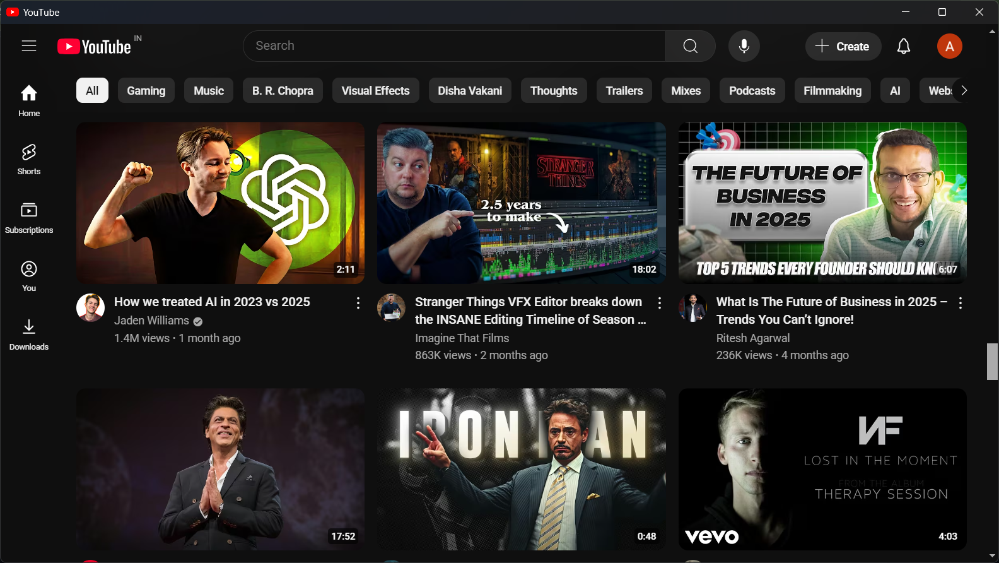
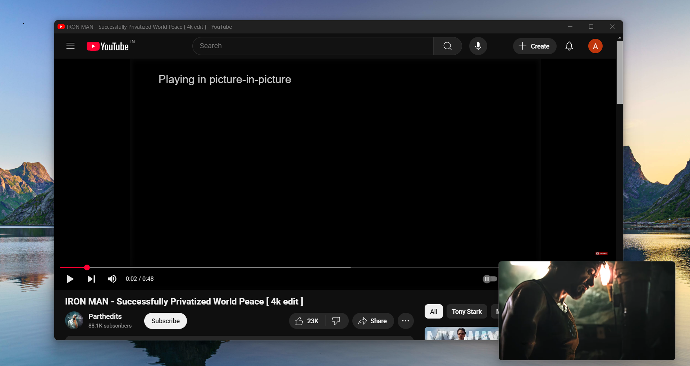

# 🎬 Ad-Free YouTube Desktop App

A lightweight, distraction-free YouTube desktop application built using Electron.  
No ads. No clutter. Just content.

---

## ⚡ Features

- Completely **ad-free** YouTube experience
- Minimal and sleek interface
- **Picture-in-picture** mode for multitasking
- **Keyboard shortcuts** for fast navigation
- Menu toggle to keep the interface clean

---

## ⌨️ Keyboard Shortcuts

| Action               | Shortcut                |
|----------------------|--------------------------|
| Home                 | `Ctrl + H`               |
| Back                 | `Ctrl + ← (Left Arrow)`  |
| Forward              | `Ctrl + → (Right Arrow)` |
| Refresh              | `Ctrl + R`               |
| Picture-in-Picture   | `Ctrl + P`               |
| Toggle Menu Bar      | `Alt`                    |

---

## 📸 Snapshots

> 📍 *Screenshots of the app in action*

| Home Screen | Picture-in-Picture |
|-------------|--------------------|
|  |  |

---

## 🚀 Installation

```bash
# Clone the repository
git clone https://github.com/yourusername/adfree-youtube.git
cd adfree-youtube

# Install dependencies
npm install

# Run the app
npm start
```

If you like my work, please consider supporting me by

[](https://www.buymeacoffee.com/abhishekvankar)


